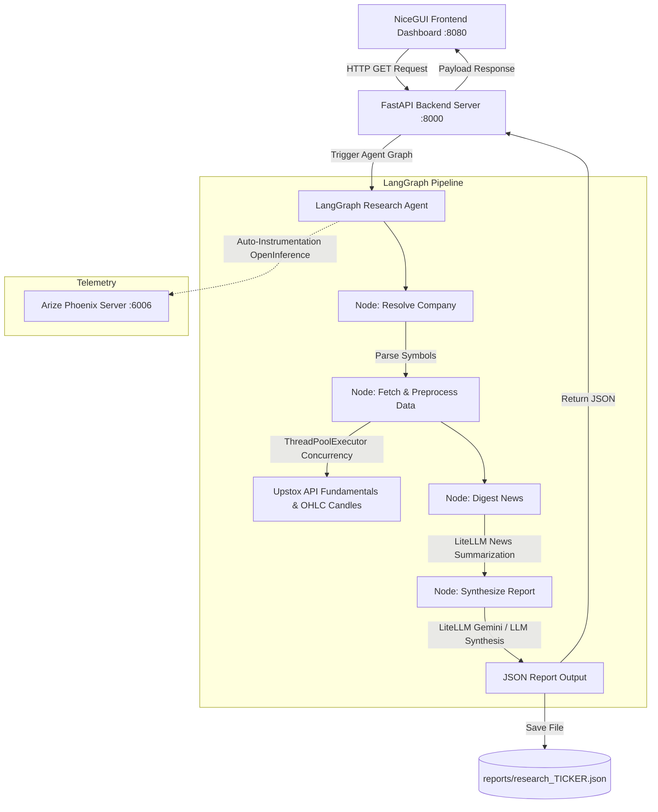
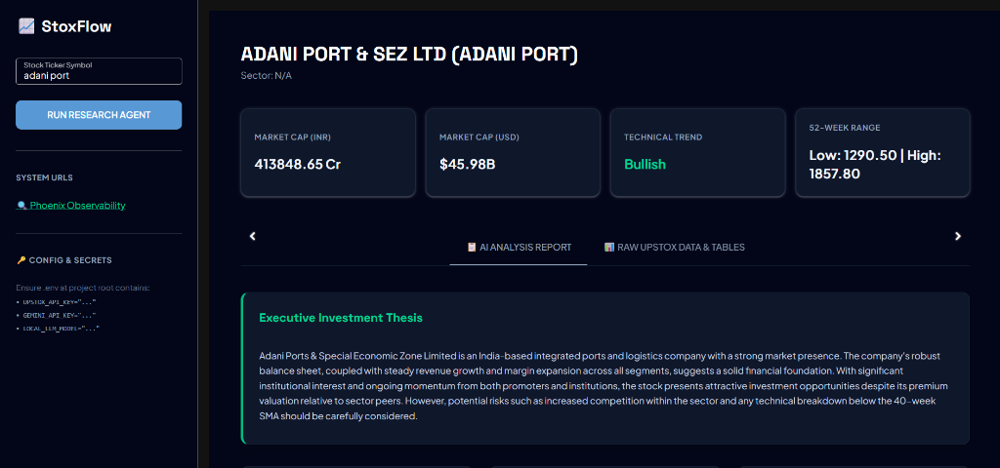
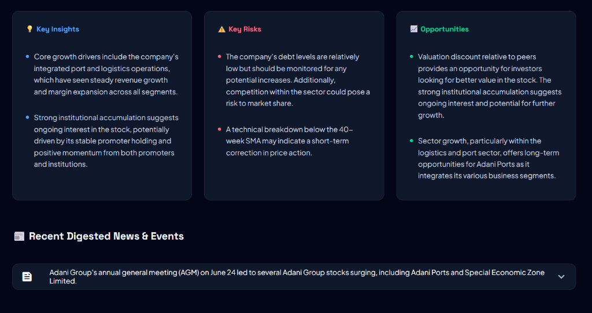

# StoxFlow: AI Stock Research Agent

[](https://www.python.org/)
[](https://fastapi.tiangolo.com/)
[](https://nicegui.io/)
[](https://phoenix.arize.com/)
[](LICENSE)

StoxFlow is an AI stock research agent and financial data analytics tool designed for Indian equities. It uses a **LangGraph** multi-node workflow to retrieve and process equity data for stocks listed on the National Stock Exchange (NSE). The agent fetches market data from the **Upstox API**, runs concurrent pre-processing for fundamental metrics, parses weekly price candles, digests market news, and synthesizes structured JSON investment reports displayed in a web dashboard.

---

## Architecture & Data Flow

StoxFlow contains three components:
1. **Frontend Dashboard (NiceGUI)**: A web interface to input stock tickers, view execution progress, and display reports and financial tables.
2. **Backend API (FastAPI)**: A service that handles requests, executes the data pipeline, and serves structured data.
3. **Engine (LangGraph & LiteLLM)**: A workflow that orchestrates ticker resolution, parallel data pre-processing, news digestion, and JSON report generation.



---

## Screenshots

### Dashboard Overview


### Research Report Details


---

## Key Features

* **Graph Orchestration**: Uses `LangGraph` to manage states, errors, and task execution order.
* **Concurrent Fetching**: Uses `ThreadPoolExecutor` to fetch and pre-process fundamentals (key ratios, shareholding patterns, income statement, balance sheet, cash flows, corporate actions, and competitors) and technical indicators.
* **Price Candle Processing**: Parses historical weekly OHLC candle arrays to calculate trend baselines (like 40-Week SMA) and 52-week price ranges.
* **News Analysis**: Filters news articles, scores sentiment, and summarizes takeaways.
* **Web UI**: A NiceGUI dashboard with dark mode, tabs, and tables for raw metrics.
* **Telemetry**: Integrates OpenInference to stream execution traces directly to Arize Phoenix for debugging prompts and monitoring latency.

---

## Authentication & Upstox API Analytics Token Setup

StoxFlow retrieves data, fundamentals, and candle series from the **Upstox API**. You must configure an Upstox Analytics Token for requests.

### Step-by-Step Instructions:

1. **Access Upstox Developer Portal**:
   * Log in to the [Upstox Developer Console](https://developer.upstox.com/).
2. **Read the Official Documentation**:
   * Refer to the token setup steps in the documentation:  
     [Upstox API Analytics Token Documentation](https://upstox.com/developer/api-documentation/analytics-token/)
3. **Generate Your Analytics Token**:
   * Generate a permanent **Upstox Analytics Token** as described in the documentation.
4. **Configure the Environment Variable**:
   * Create a `.env` file in the root directory (see [Environment Configuration](#environment-configuration)).
   * Set `UPSTOX_API_KEY`:
     ```env
     UPSTOX_API_KEY="your_upstox_analytics_token_here"
     ```

---

## Environment Configuration

Configure credentials in a `.env` file at the root of the project:

```env
# Upstox API Authentication
UPSTOX_API_KEY="your_upstox_analytics_token_here"

# Google Gemini API Configuration (Primary LLM Engine)
GOOGLE_API_KEY="your_google_gemini_api_key_here"

# LLM Model Choices (LiteLLM Supported)
CLOUD_LLM_MODEL="gemini/gemini-2.5-flash-lite"
LOCAL_LLM_MODEL="ollama/qwen2.5:3b"

# Optional/Fallback API Keys
OPENAI_API_KEY="your_openai_api_key_here"

# Engine Control Flags
CRAWL_NEWS=true
```

---

## Installation

1. **Clone the Repository**:
   ```bash
   git clone https://github.com/yourusername/stoxflow-agent.git
   cd stoxflow-agent
   ```

2. **Set Up a Virtual Environment**:
   ```bash
   python -m venv venv
   # On Windows:
   .\venv\Scripts\activate
   # On macOS/Linux:
   source venv/bin/activate
   ```

3. **Install Dependencies**:
   ```bash
   pip install -r requirements.txt
   ```

---

## Running the Application

The script `run.py` starts the FastAPI backend, the NiceGUI frontend, and the Arize Phoenix server.

To start:
```bash
python run.py
```

Endpoints:

* **NiceGUI Frontend Dashboard**: [http://localhost:8080](http://localhost:8080)
* **FastAPI Backend API**: [http://127.0.0.1:8000](http://127.0.0.1:8000)
* **Phoenix Observability Panel**: [http://localhost:6006](http://localhost:6006) (or [http://localhost:4000](http://localhost:4000))

Stop the servers using `Ctrl+C` in the terminal.

---

## Observability & Diagnostics

Tracing helps debug prompt behavior, agent loops, and execution errors.

### Arize Phoenix Integration
StoxFlow connects to **Arize Phoenix** using OpenInference. It captures traces for node transitions, LLM calls, input/output prompts, and token usage.

### How to View Traces:
1. Open [http://localhost:6006](http://localhost:6006) in your browser.
2. Select the `marketsense-agent` project to:
   * See execution times for nodes like `resolve_company`, `fetch_company_data`, `digest_news`, and `synthesize_report`.
   * Inspect the exact prompts sent to the LLM and the responses.
   * Check token count and model latency.

### Observability Logs
Subprocess logs are saved in the `logs/` directory:
* **`logs/phoenix.log`**: Phoenix server startup and debug logs.
* **`logs/backend.log`**: FastAPI request logs and LangGraph execution prints.

---

## Analysis Outputs

Synthesized investment reports are saved as JSON files in the `reports/` folder:
```
StoxFlow/
├── backend/
├── frontend/
├── logs/
├── data/
└── reports/
    ├── research_TCS.json
    ├── research_ONGC.json
    └── research_ADANI PORT.json     <-- Example Generated Output
```

### JSON Schema Output Example:
Reports saved under `reports/research_{TICKER}.json` use the following schema:

```json
{
  "company": {
    "symbol": "TICKER",
    "name": "Company Name",
    "sector": "Sector Name"
  },
  "profile": {
    "description": "Summary of the business profile...",
    "market_cap_inr": "₹X Cr.",
    "market_cap_usd": "$Y B"
  },
  "fundamentals": {
    "ratios_analysis": "Valuation and efficiency analysis relative to sector peers...",
    "shareholding_analysis": "Promoter and institutional holding trends...",
    "financials_analysis": "Balance sheet and cash flow health observations..."
  },
  "price_analysis": {
    "trend": "ABOVE 40-Week SMA (Bullish Macro Structure)",
    "rsi_or_momentum": "Price actions and indicators summary...",
    "fifty_two_week_range": "Low: X | High: Y"
  },
  "news_and_events": [
    {
      "event": "Headline of news event",
      "sentiment": "positive/negative/neutral",
      "impact": "high/medium/low",
      "summary": "Summary of event impact..."
    }
  ],
  "insights": [
    "Growth driver...",
    "Efficiency driver..."
  ],
  "risks": [
    "Risk factor...",
    "Technical support breakdown level..."
  ],
  "opportunities": [
    "Valuation discount...",
    "Sector tailwinds..."
  ],
  "summary": "Executive investment thesis wrapping the complete bull/bear case outlook..."
}
```

---

## Contributing

1. Fork the Repository.
2. Create your Feature Branch (`git checkout -b feature/AmazingFeature`).
3. Commit your Changes (`git commit -m 'Add some AmazingFeature'`).
4. Push to the Branch (`git push origin feature/AmazingFeature`).
5. Open a Pull Request.

---

## License

Distributed under the MIT License. See `LICENSE` for more information.
